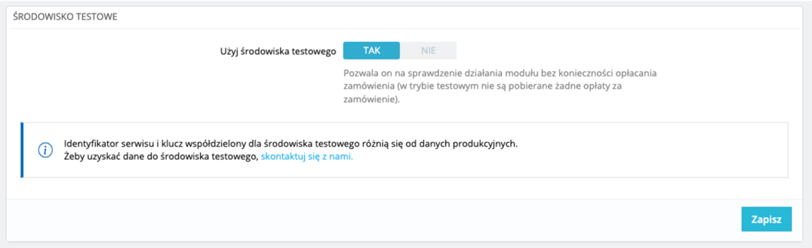
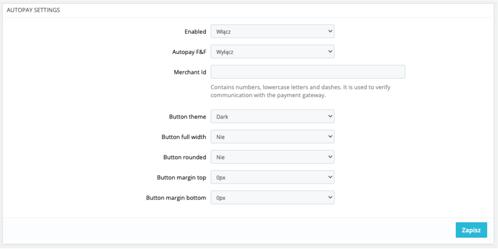

# Dokumentacja APC Proces instalacji

1. Zainstaluj wtyczkę znajdującą się pod [tym adresem](https://github.com/bluepayment-plugin/prestashop-plugin-1.7/blob/autopay/bm-bluepayment.zip?raw=true).
2. Przejdź do panelu administracyjnego Prestashop, następnie do moduły, zainstaluj moduł a następnie przejdź do ustawień wtyczki
3. Uruchom tryb testowy
   
4. Następnie przejdź do zakładki “ustawienia płatności” i skonfiguruj Autopay
   
   Pozycja „Włączony” musi zostać ustawiona na „Włącz”
   Należy wpisać Merchant Id podany przez zespół APC
   Opcja „Autopay F&F” to opcja testowa wyświetlająca przycisk APC po podaniu parametru test_autopay=1 w URL – włącz jeśli chcesz by przycisk domyślnie był ukryty
   Pozostałe opcje opisują wygląd przycisku- motyw, szerokość przycisku, zaokrąglenie przycisku oraz marginesy: górny i dolny
5. Po skonfigurowaniu APC poinformuj nas o tym

## Information
Przycisk: https://www.figma.com/file/Fao7keKEIPmhJGSU98shdd/Autopay-Buttons  
Więcej informacji: [README.md](README.md)